# Metastore Diagrams

This document contains Mermaid diagrams for the Entity-Relationship model and System Architecture.

## Entity-Relationship Diagram

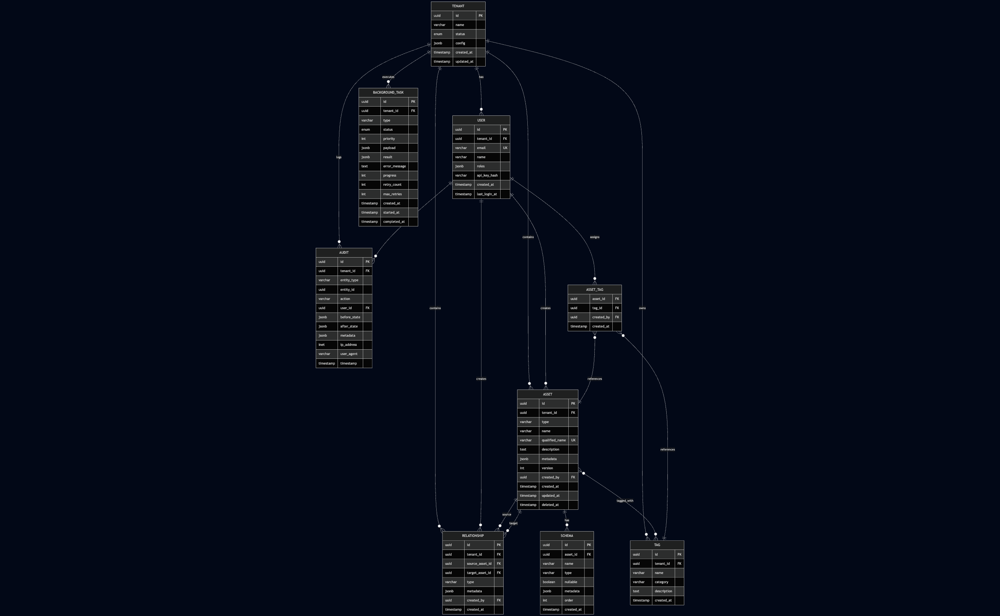

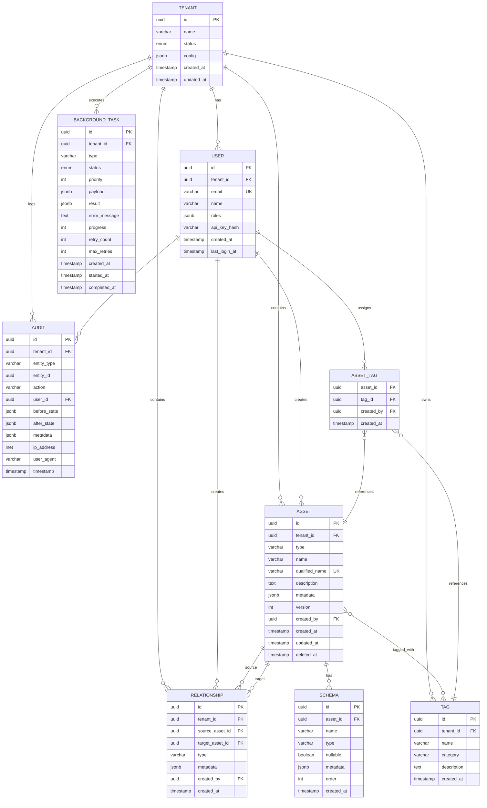

## System Architecture Diagram

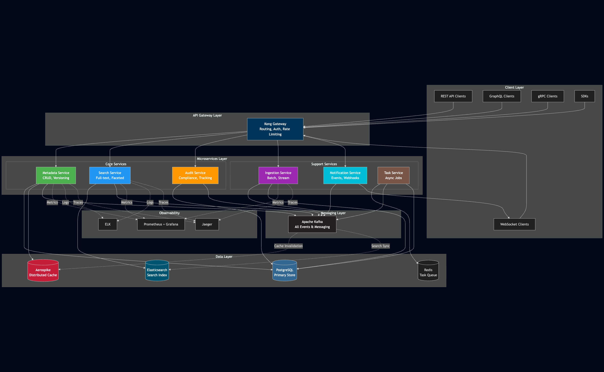

```mermaid
graph TB
    subgraph "Client Layer"
        REST[REST API Clients]
        GraphQL[GraphQL Clients]
        gRPC[gRPC Clients]
        WS[WebSocket Clients]
        SDK[SDKs]
    end
    
    subgraph "API Gateway Layer"
        Router[Vert.x Router]
        Auth[Authentication Middleware]
        RateLimit[Rate Limiting]
        CORS[CORS Handler]
    end
    
    subgraph "Application Service Layer"
        subgraph "Core Services"
            MetadataService[Metadata Service<br/>CRUD, Versioning]
            SearchService[Search Service<br/>Full-text, Faceted]
            AuditService[Audit Service<br/>Change Tracking]
            NotifyService[Notification Service<br/>Events, Webhooks]
        end
        
        subgraph "Support Services"
            AuthService[Auth Service<br/>JWT, OAuth2, RBAC]
            TenantService[Tenant Service<br/>Isolation, Quotas]
            IngestionService[Ingestion Service<br/>Batch, Stream]
            TaskManager[Background Task Manager<br/>Async Jobs, Scheduling]
        end
    end
    
    subgraph "Data Access Layer"
        subgraph "Primary Store"
            Postgres[(PostgreSQL RDS<br/>Primary Datastore<br/>ACID, Relationships)]
        end
        
        subgraph "Cache Layer"
            Aerospike[(Aerospike<br/>Distributed Cache<br/>Sub-ms Latency)]
        end
        
        subgraph "Search Index"
            Elasticsearch[(Elasticsearch<br/>Full-text Search<br/>Aggregations)]
        end
    end
    
    subgraph "Infrastructure"
        EventBus[Vert.x Event Bus]
        TaskQueue[Task Queue<br/>Redis/RabbitMQ]
        Monitoring[Prometheus<br/>Metrics]
        Logging[Log Aggregation<br/>ELK/Loki]
        Tracing[Jaeger<br/>Distributed Tracing]
    end
    
    REST --> Router
    GraphQL --> Router
    gRPC --> Router
    WS --> Router
    SDK --> Router
    
    Router --> Auth
    Router --> RateLimit
    Router --> CORS
    
    Auth --> MetadataService
    Auth --> SearchService
    Auth --> AuditService
    Auth --> NotifyService
    Auth --> AuthService
    Auth --> TenantService
    Auth --> IngestionService
    Auth --> TaskManager
    
    MetadataService --> Postgres
    MetadataService --> Aerospike
    MetadataService --> EventBus
    
    SearchService --> Elasticsearch
    SearchService --> Postgres
    
    AuditService --> Postgres
    
    NotifyService --> EventBus
    NotifyService --> WS
    
    AuthService --> Postgres
    
    TenantService --> Postgres
    
    IngestionService --> Postgres
    IngestionService --> EventBus
    IngestionService --> TaskQueue
    
    TaskManager --> TaskQueue
    TaskManager --> Postgres
    TaskManager --> EventBus
    
    Postgres -.Cache Invalidation.-> Aerospike
    Postgres -.Index Update.-> Elasticsearch
    
    MetadataService -.Metrics.-> Monitoring
    SearchService -.Metrics.-> Monitoring
    AuditService -.Metrics.-> Monitoring
    
    MetadataService -.Logs.-> Logging
    SearchService -.Logs.-> Logging
    
    MetadataService -.Traces.-> Tracing
    SearchService -.Traces.-> Tracing
    
    style Postgres fill:#336791,color:#fff
    style Aerospike fill:#C41E3A,color:#fff
    style Elasticsearch fill:#005571,color:#fff
    style MetadataService fill:#4CAF50,color:#fff
    style SearchService fill:#2196F3,color:#fff
    style AuditService fill:#FF9800,color:#fff
```

## Component Interaction Flow

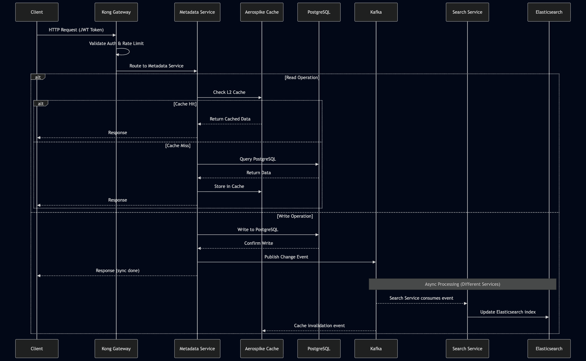

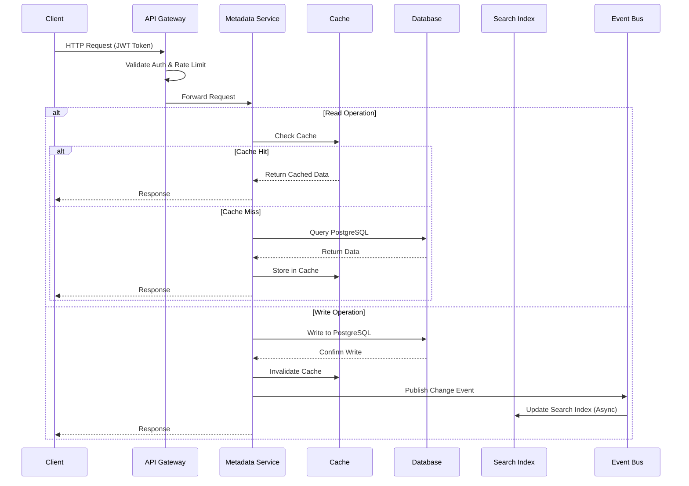

## Data Flow Diagram

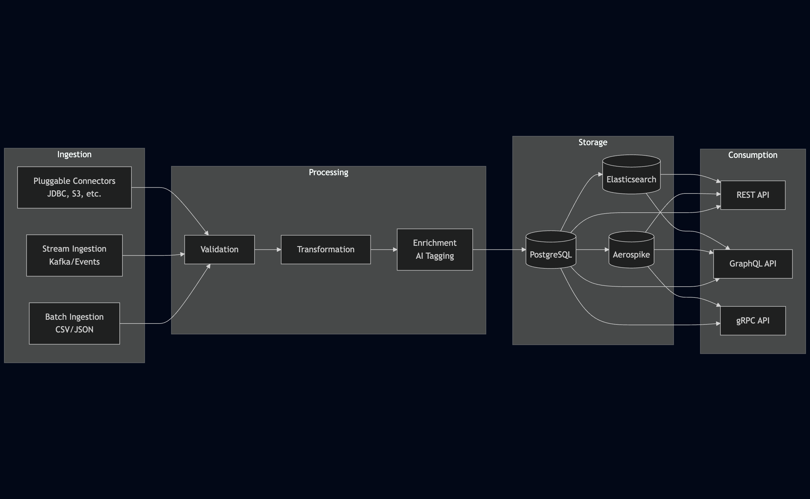

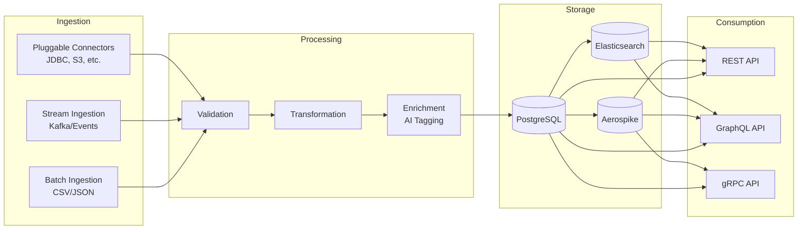

## Deployment Architecture

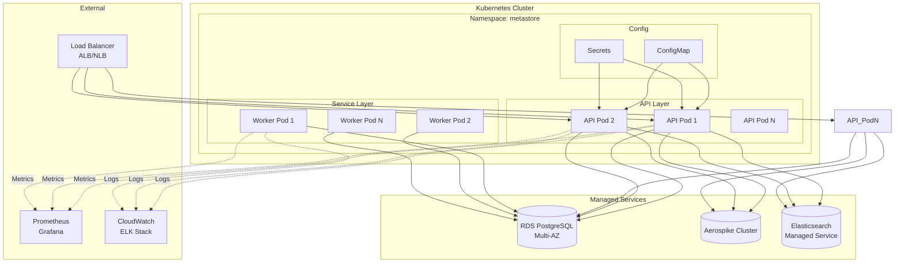

## Multi-Tenancy Isolation

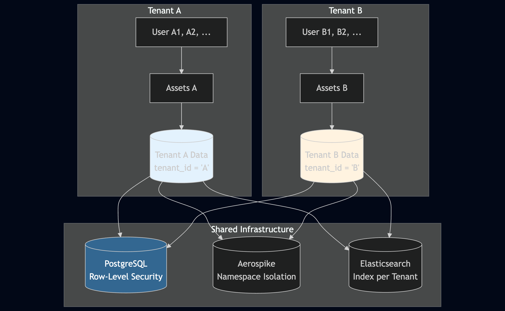

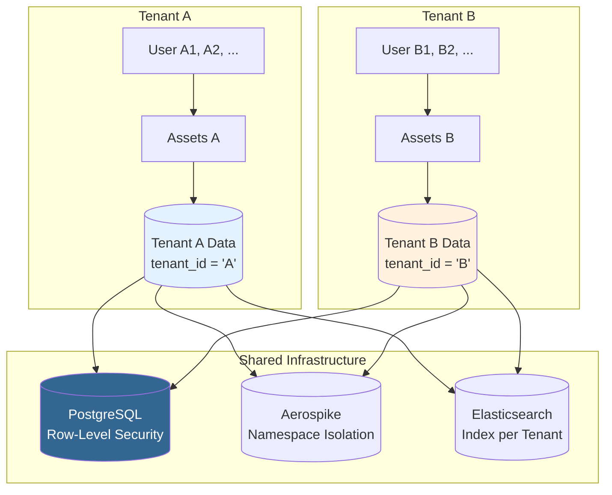

